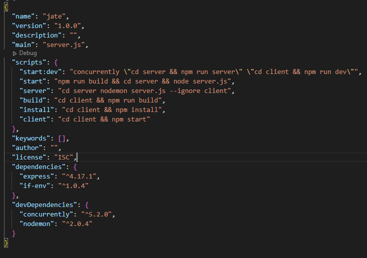
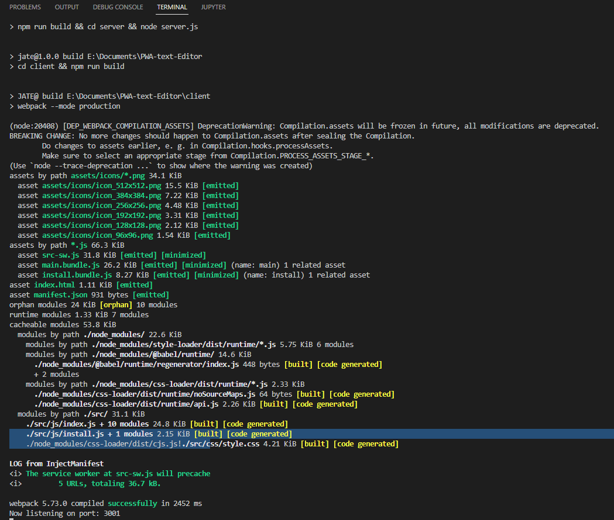
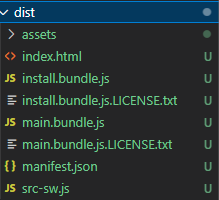
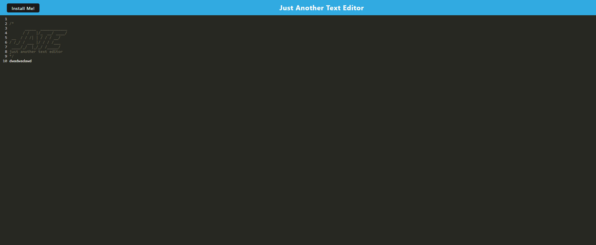
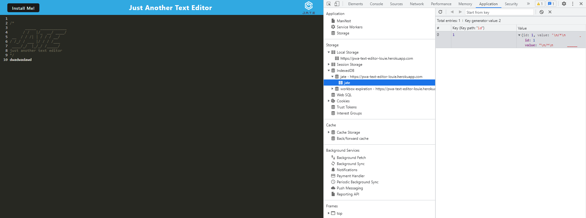
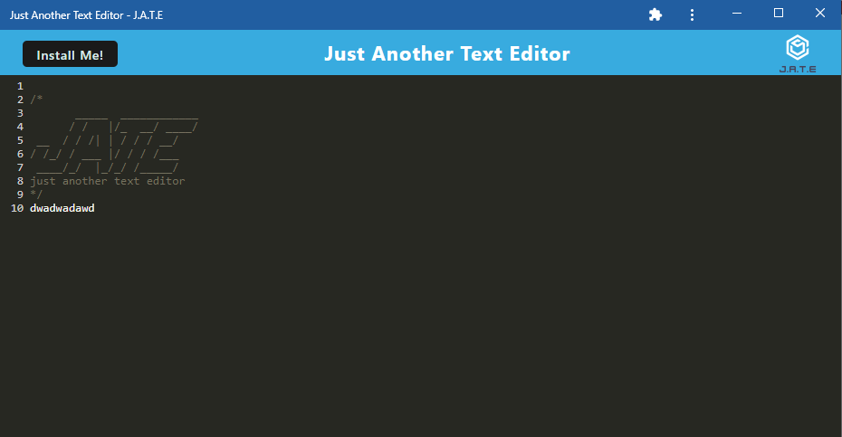

# PWA-text-Editor
This a text editor that runs on any web browser with (PWA). A progressive web app (PWA) is a website that looks and behaves as if it is a mobile app. PWAs are built to take advantage of native mobile device features, without requiring the end user to visit an app store, make a purchase and download software locally.  The application will also function offline.

## Table of Content

  - [Feature](#feature)
  - [Installation](#installation)
  - [Usage](#usage)
  - [Credits](#credits)
  - [License](#license)

## Feature

Serves as a text with PWA that you can use the the text-editor offline

## Installation

Step 1: Clone the repo (HTTPS: `git clone https://github.com/louieiply/PWA-text-Editor.git` or SSH: `git@github.com:louieiply/PWA-text-Editor.git`)

Step 2: Install Node.js

Step 3: npm start (install all components from the package.json)

## Usage

### Screenshot

1. List of npm commands

         * npm start:dev - Start both client and server concurrently
         * npm start - Start server and cilent
         * npm server - Start server only
         * npm build - Build client only
         * npm client - Start client only

2. Building Progress

3. A "dist" folder will be created inside the client folder, including all frontend components into different bundle files

4. Enter anything you want into the text-editor

5. All text are stored as indexdb call "jate".

6. Lastly, after you install the PWA you can use it offline as seperate application

## Credits

Github, express.js(npm), if-env(npm), babel-loader(npm), css-loader(npm), html-webpack-plugin (npm), http-server(npm), style-loader(npm), webpack (npm), webpack-cli (npm), webpack-dev-server (npm), webpack-pwa-manifest (npm), workbox-webpack-plugin (npm)

## License
[MIT License - Copyright (c) 2022 Louie Ip](./LICENSE)